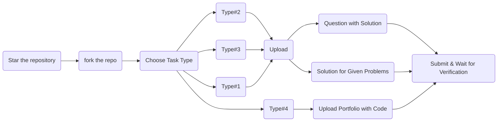

<h1 align="center" >HackElite2023</h1>

   

   
   
   
   

## Contributors of `Hacktoberfest 2023`

  

# What is Hacktoberfest?

Hacktoberfest is a program by Digital Ocean, DEV and Github, where you can easily win a T-Shirt just by making 4 pull requests in the month of October to any open source projects on Github.

# HackElite

HackElite is a repository created & maintained by DevNation, coding community at AJIET, this is open to all & everyone irrespective of your coding levels.

## How To Contribute

We welcome all contributions, suggestions & ideas for improvement from the community.
You can contribute by posting in the Solutions folder in Problem Type of your choice.
## First star the repository

### Pre-Requistes 

- GitHub Account - [click here to create account](https://github.com)

- Visual Studio Code or any other code editor - [click here to download](https://code.visualstudio.com/download)

- Git version control - [click here to download](https://git-scm.com/)

### Flowchart to contribute to this repo

_Note:_
_When Uploading & Submitting Pull Requests you need to submit it within a folder & the folder name must be your GitHub Username_

#### Fork the repository [click here](https://github.com/Ajiet-DevNation/HackElite2023/fork)

There are 4 Types of Tasks, those are as follows:

**Type#1:**

- Type#1 consist of various code snippets that are almost correct but have some errors or missing parts.
- You can contribute to this task either by uploading different problems that are similar in nature as well as the corresponding solution or by uploading solutions for given problems.

**Type#2:**

- Type#2 consists of competitive programming sums.
- You can contribute for this either by uploading more questions related to competitive programming as well as the respective solutions or by uploading solutions for the given problems.

**Type#3:**

- Type#3 consist of designing UI represented by the given images.
- You can contribute for this either by uploading your own UI images along with appropriate code or by uploading solutions for the given tasks.

**Type#4:**

- Type#4 is a folder to upload various kinds of portfolio websites.
- You can contribute by uploading your portfolio website screenshots along with code.

**After you upload your solution create new Pull request and wait for reviewers to review your pull request before getting it merged**
